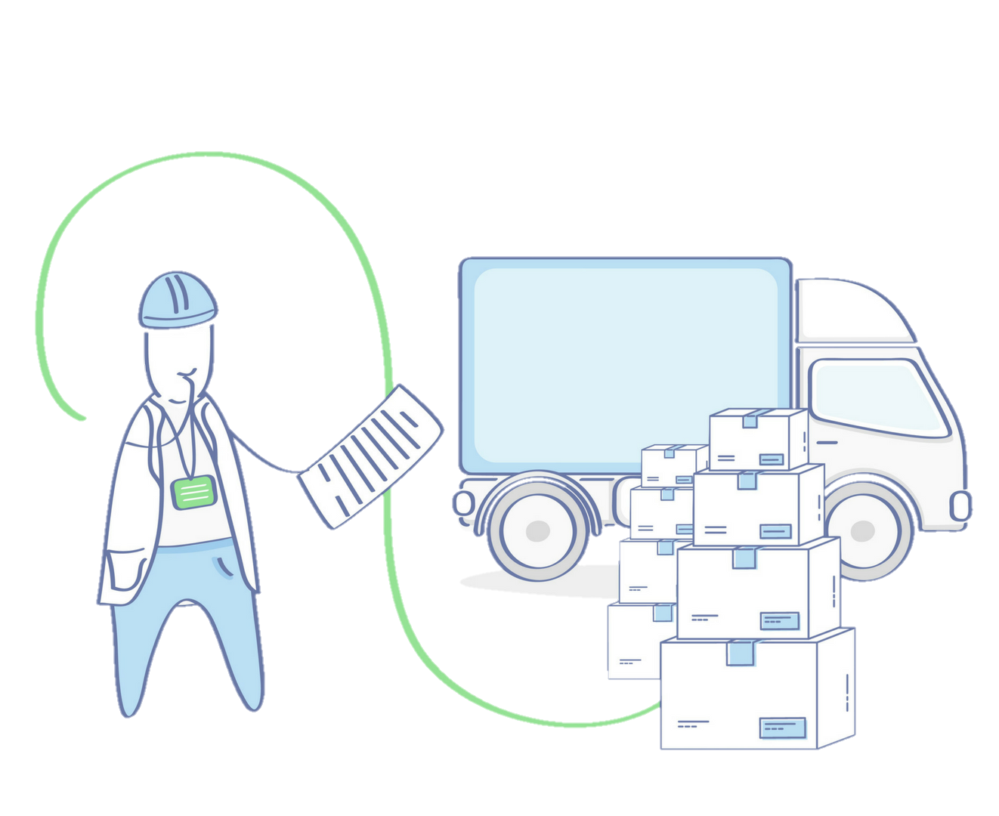

# ThePlasticShed_2

### Trabajo final de la asignatura Ingeniería del Software II, curso 2021/2022.

  

Implementación de una aplicación web empleando Java Session Beans para una empresa de plásticos con las siguientes características:
-   Control de la entrada, producción, salida y stock de productos y/o componentes.
-   Gestión de usuarios, capacidad del almacén y últimos movimientos.
-   Gestión de los productos en relación a los clientes, su  disponibilidad y necesidad de productos ya producidos y almacenados.
-   Cada uno de los agentes que interactúan en la aplicación web tendrá diferentes permisos a la hora de interactuar con el stock del almacén, el taller de producción y los usuarios de la plataforma.

## Entorno de desarrollo 📋

Este es un proyecto maven, desarrollado en el IDE Netbeans.

## Tecnologías 🔧

Se ha empleado Java como principal lenguaje de programación, junto con xhtml, javascript y css para las páginas de la aplicación web. Demás tecnologías:
-   Servidor backend: Payara Server, en su versión 5.2021.10
-   Tecnología de base de datos: MySql 8.0.26
-   Capa de persistencia: JPA
-   Versión de Java: JDK 1.8.0_321
-   Como Framework para aplicaciones Java basadas en web: JSF
-   Parte frontend: Primefaces
-   Controlador y gestor versiones: repositorio habilitado en GitHub

## Autores ✒️

Diego Fernández Velasco.  
Pablo de la Hera Martinez.  
Pablo Javier Barrio Navarro.   
Iconos diseñados por <a href="https://www.freepik.com" title="Freepik">Freepik</a>

##

  
  

